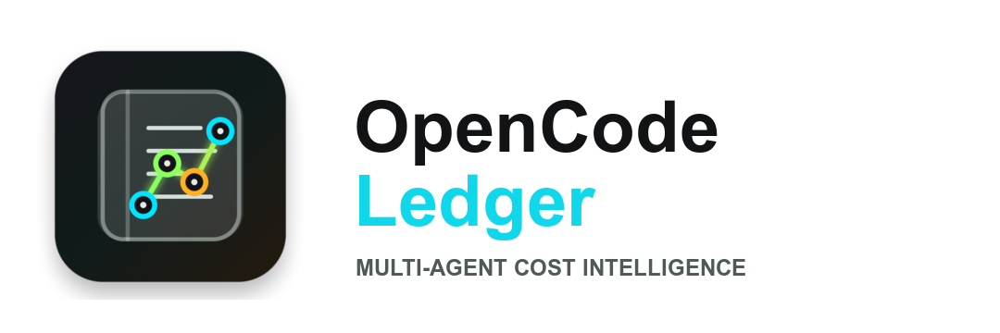

<p align="center"></p>

<h1 align="center">OpenCode Ledger</h1>

<p align="center">
  <a href="https://opencode.ai"></a>
  <a href="#"></a>
  <a href="LICENSE"></a>
  <a href="https://buymeacoffee.com/notfixingit"></a>
</p>

OpenCode Ledger tracks token usage and estimated cost across durable OpenCode session trees. It is built for workflows where a resumed session may spawn background agent sessions, and the user-facing ledger should include the root session plus its children while staying readable, deduplicated, and fast.

## Core Features

* **Multi-Agent Isolation**: Tracks precise prompt/completion tokens and API calls isolated by agent, provider, and model.
* **Durable Session Tree Accounting**: Reads OpenCode's saved session history for the active session plus child background sessions, while excluding unrelated sessions.
* **Streaming-Safe Accounting**: Prefers recorded `step-finish` parts over message-level usage so repeated update hooks do not double-count.
* **Share-of-Usage Percentages**: Shows what percentage of total tokens each agent, model, and session slice used.
* **Realtime Cost Modeling**: Calculates estimated spend from an extensible, case-insensitive provider/model pricing map.
* **Session Summary Toasts**: Shows a compact usage summary when the session becomes idle.
* **Saved Ledger Commands**: Saves summary/detail Markdown or JSON reports through `/ledger` and `/ledger-json`, then returns a compact path and totals.

## Installation

To copy the plugin and safely register it in your `opencode.json` / `opencode.jsonc` configs without breaking existing plugins:

### Automated Setup
You can install and configure the plugin directly from the terminal without manual cloning.

#### Stable Release
```bash
curl -fsSL https://raw.githubusercontent.com/notfixingit3/ledger/main/install.sh | sh
```

#### Development Release
```bash
curl -fsSL https://raw.githubusercontent.com/notfixingit3/ledger/dev/install.sh | sh -s -- --channel dev
```

#### Pinned Release
```bash
curl -fsSL https://raw.githubusercontent.com/notfixingit3/ledger/vX.Y.Z/install.sh | sh -s -- --channel vX.Y.Z
```

> [!TIP]
> The automated installer handles JSON and JSONC configs, creates timestamped backups before editing, and adds the plugin without overriding existing active plugins.

Installer options:

```bash
sh install.sh --yes
sh install.sh --no-config
sh install.sh --channel dev
sh install.sh --channel vX.Y.Z
sh install.sh --dry-run
sh install.sh --force
sh install.sh --uninstall
```

`--yes` skips the config prompt, `--no-config` only updates the plugin file, `--dry-run` previews writes, `--force` reinstalls the same version, and `--uninstall` removes Ledger config entries while leaving plugin files and backups in place.

### Upgrading
Existing installs can upgrade by rerunning the installer for the channel they want:

```bash
curl -fsSL https://raw.githubusercontent.com/notfixingit3/ledger/main/install.sh | sh
```

or, for the development channel:

```bash
curl -fsSL https://raw.githubusercontent.com/notfixingit3/ledger/dev/install.sh | sh -s -- --channel dev
```

The installer prints the installed and target versions. If they match, it skips reinstalling unless you pass `--force`. It can refresh the `/ledger` and `/ledger-json` commands in your OpenCode config; when prompted, answer `y` if you want it to normalize the config entry, including removing older command fields such as `subtask`.

Before replacing an existing plugin file, the installer writes a timestamped backup next to it, such as `~/.config/opencode/plugins/ledger.ts.bak.20260524143000`. Before modifying an existing OpenCode config, it also writes a timestamped config backup next to that file.

After upgrading, restart OpenCode. Ledger reads OpenCode's saved session history, so there is no separate Ledger data store to migrate.

To roll back the plugin file, restore one of the timestamped backups:

```bash
cp ~/.config/opencode/plugins/ledger.ts.bak.20260524143000 ~/.config/opencode/plugins/ledger.ts
```

### Manual Configuration
1. Copy [index.ts](./index.ts) to `~/.config/opencode/plugins/ledger.ts`.
2. Add the installed file URL and `/ledger` command to `~/.config/opencode/config.json` or `config.jsonc`:

```jsonc
{
  "plugin": [
    "oh-my-openagent@latest",
    "file:///Users/you/.config/opencode/plugins/ledger.ts"
  ],
  "command": {
    "ledger": {
      "template": "Use ledger tool. If command arguments ask for summary, set mode to summary; otherwise set mode to detail. Return only output.",
      "description": "Save multi-agent token and cost ledger"
    },
    "ledger-json": {
      "template": "Use ledger_json tool. Return only output.",
      "description": "Save multi-agent token and cost ledger as JSON"
    }
  }
}
```

## Configuration

You can still edit the built-in pricing map in `index.ts`, but plugin options are the cleaner upgrade-safe path:

```jsonc
{
  "plugin": [
    [
      "file:///Users/you/.config/opencode/plugins/ledger.ts",
      {
        "defaultPrice": { "input": 0.000005, "output": 0.000015 },
        "exportDirectory": "ledger-reports",
        "pricing": {
          "anthropic": {
            "claude-4-sonnet": { "input": 0.000003, "output": 0.000015 }
          }
        }
      }
    ]
  ]
}
```

The `ledger` tool itself is deterministic and reads OpenCode's saved session messages and child-session list. The sample `/ledger` command is still an OpenCode command template, so OpenCode may route that slash command through the assistant before the tool is called.

Usage:

```text
/ledger
/ledger summary
/ledger detail
/ledger-json
```

`/ledger` saves a Markdown file and `/ledger-json` saves the raw computed report object as JSON. Files are written to `ledger-reports/` in the active project directory by default with names like `ledger-20260525-143000-000.md`; set `exportDirectory` in plugin options to choose another folder. The command response includes the saved path, top-level totals, totals by agent, and totals by agent/model. Total-token fields show both exact and compact values, such as `200,000 (200k)`.

> [!NOTE]
> For integration guidelines for specialized subagents, see [AGENTS.md](./AGENTS.md).
